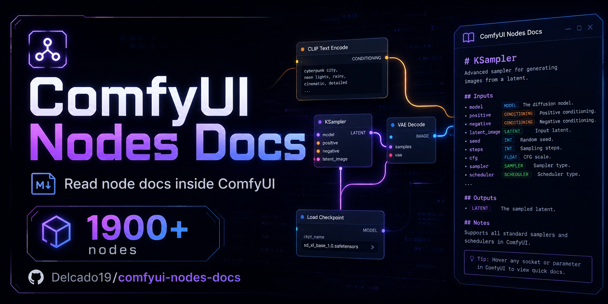
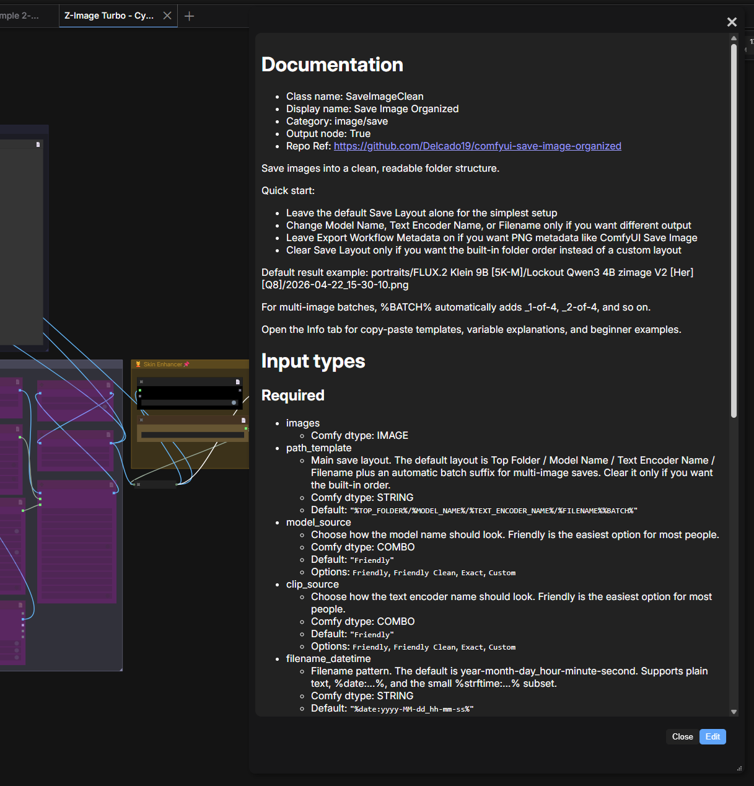

<!-- markdownlint-disable -->
<p align="center">
  
</p>
<h1 align="center">comfyui-nodes-docs</h1>
<h4 align="center">In-app documentation for 3500+ ComfyUI nodes — now in English & 中文 ✨</h4>

<p align="center">
  <a href="https://github.com/comfyanonymous/ComfyUI"></a>
  
  
</p>

<!-- markdownlint-restore -->

[中文文档](README_zh.md) ｜ English Document

A ComfyUI plugin that shows rich, per-node documentation right inside the graph — select a node and read what every input, output, and option does without leaving the canvas. This fork adds a **full English translation** of all 3500+ node docs alongside the original Chinese, picked automatically from your ComfyUI language setting.

> Fork of the original [CavinHuang/comfyui-nodes-docs](https://github.com/CavinHuang/comfyui-nodes-docs) (created by 水门Minato & Leo). The Chinese documentation is theirs and is kept untouched; this fork adds the parallel English docs and language-aware serving.



## Installation

### comfyUI Manager

Search `comfyui-nodes-docs` in the ComfyUI Manager and install it.

### Custom installation

- Open a terminal in ComfyUI's plugin directory (e.g. `ComfyUI\custom_nodes`) and run:

  ```bash
  git clone https://github.com/Delcado19/comfyui-nodes-docs
  ```

  …or download the ZIP, extract it, and copy the resulting folder into `ComfyUI\custom_nodes\`.

- Restart ComfyUI.

### comfy-cli

If you have [comfy-cli](https://github.com/Comfy-Org/comfy-cli) installed, run `comfy node registry-install comfyui-nodes-docs` and restart ComfyUI.

## Usage

Open any workflow, right-click a node (or use the node's docs button) and the documentation panel opens beside it. The panel language follows ComfyUI's own **`Comfy.Locale`** setting — no separate switch:

- `zh*` locales → the original Chinese doc (`docs/<NodeType>.md`)
- any other locale → the English translation (`docs/<NodeType>_en.md`)
- if a translation is missing, the server falls back to the Chinese source, so every node stays documented (zero regression)

You can edit a node's doc locally from the panel; local edits are stored on your machine and never co-built into the shared Chinese cloud DB when you are viewing the English locale.

## English documentation

All ~3553 node docs ship with a parallel English `*_en.md` file (a machine-translated first pass — improvements welcome). The Chinese sources are left untouched; English lives beside them. The feature touches only two code files:

- `server/request.py` — language-aware doc lookup (a `lang` query/body parameter, plus a guard so English edits are never co-built into the Chinese cloud DB)
- `web/comfyui/creatDocsElement.js` — reads `Comfy.Locale`, passes `lang` to the doc endpoints, and localizes the doc-panel labels

Everything else is additive `*_en.md` content.

### Source-code links

In the English docs, the embedded source-code snippet that used to sit under each `# Source code` heading is replaced with a link to the node pack's GitHub repository (derived from the doc's `Repo Ref:` metadata). Embedded snippets go stale on every pack update, whereas a repository link stays current and keeps the docs lean. 2515 English docs link to their repo; docs without a `Repo Ref:` keep their embedded source (there is nothing to link to). Chinese sources are unchanged.

## Translation & doc-generation tooling

The scripts used to translate the docs, retrofit the source-code links, and generate new docs from a running ComfyUI's `/object_info` live in a separate companion repo (`comfyui-nodes-docs-tools`), so this plugin stays lean. Clone it next to this repo (as a sibling directory); its scripts default `docs/` to `../comfyui-nodes-docs/docs`, or set `COMFY_DOCS_DIR` to override.

In short, from the tools repo you point the translator at any OpenAI-compatible chat endpoint via environment variables and run `npm run translate:docs`:

```powershell
$env:OPENAI_BASE_URL = "https://your-endpoint/v1"
$env:OPENAI_API_KEY  = "your-key"
$env:OPENAI_MODEL    = "your-model"
npm run translate:docs            # or: -- --limit 50
```

The script writes a matching `_en.md` file for each source document, preserves code blocks, metadata lines, and Markdown structure, and supports caching plus resume-friendly reruns. See the tools repo's README for all scripts, flags, and environment variables.

## Node list

Being compiled — the `docs/` folder currently holds 3500+ node documents.

## Contributing

There are two ways to help:

- **Maintain the plugin** — fix issues, improve the experience, optimize the code.
- **Improve the docs** — add docs for nodes not yet covered, correct mistakes in existing docs (including the machine-translated English first pass), or update docs that lag behind a pack upgrade.

### How to contribute

- Fork the repo to your own GitHub account.
- Create a branch for your changes, make and commit them.
- Open a pull request against the `main` branch.
- After review, your changes are merged and released.

### Add a new node doc

Create a Markdown file named after the `node type` in the `docs` folder, e.g. `CLIPMergeSimple.md` (see [docs/CLIPMergeSimple.md](docs/CLIPMergeSimple.md) for a full example), using this structure:

<pre><code># Documentation
- Class name: Node name
- Category: Node category
- Output node: False
- Repo Ref: https://github.com/xxxx

Description of nodes

# Input types

Node input types

# Output types

Node output types

# Usage tips
- Infra type: GPU

# Source code

Node source code
</code></pre>

For an English doc, name the file `<NodeType>_en.md` and follow the same structure (English prose, repository link under `# Source code`).

## Changelog

See [CHANGELOG.md](CHANGELOG.md) for the fork's changes (English docs, language-aware serving, source-code links, tooling extraction). The upstream Chinese update log lives in [README_zh.md](README_zh.md).

## Credits

- Original plugin and Chinese documentation: [CavinHuang/comfyui-nodes-docs](https://github.com/CavinHuang/comfyui-nodes-docs) by 水门Minato & Leo.
- English translation, language-aware serving, and tooling: this fork.
